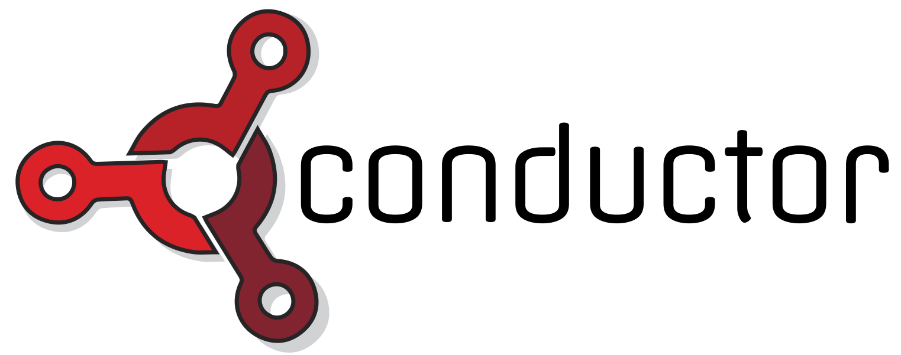

# Conductor

Conductor is an _orchestration_ engine that runs in the cloud.  

## Motivation

We built Conductor to help us orchestrate microservices based process flows at Netflix with the following features:

* Allow creating complex process / business flows in which individual task is implemented by a microservice.
* A JSON DSL based blueprint defines the execution flow.
* Provide visibility and traceability into the these process flows.
* Expose control semantics around pause, resume, restart, etc allowing for better devops experience.
* Allow greater reuse of existing microservices providing an easier path for onboarding.
* User interface to visualize the process flows.
* Ability to synchronously process all the tasks when needed.
* Ability to scale millions of concurrently running process flows.
* Backed by a queuing service abstracted from the clients.
* Be able to operate on HTTP or other transports e.g. gRPC.

**Why not peer to peer choreography?**

With peer to peer task choreography, we found it was harder to scale with growing business needs and complexities.
Pub/sub model worked for simplest of the flows, but quickly highlighted some of the issues associated with the approach:

* Process flows are “embedded” within the code of multiple application.
* Often, there is tight coupling and assumptions around input/output, SLAs etc, making it harder to adapt to changing needs.
* Almost no way to systematically answer “how much are we done with process X”?
