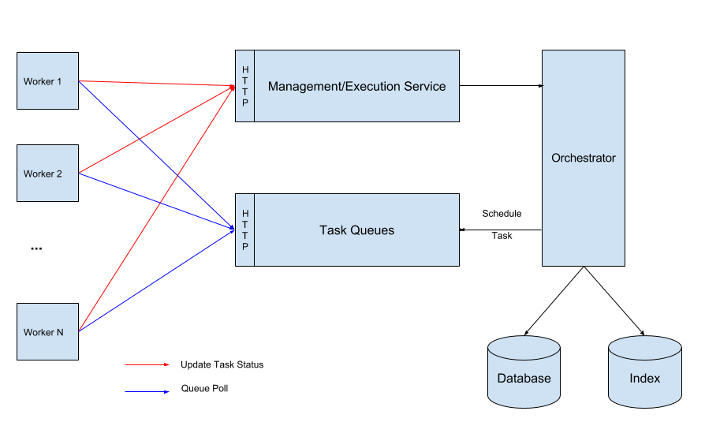

# High Level Architecture


The API and storage layers are pluggable and provide ability to work with different backend and queue service providers.

# Installing and Running

**Requirements**

1. **Database**: [Dynomite](https://github.com/Netflix/dynomite)
2. **Servlet Container**: Tomcat, Jetty, or similar running JDK 1.8 or higher

## Run In-Memory Server
Follow the steps below to quickly bring up a local Conductor instance backed by an in-memory database with a simple kitchen sink workflow that demonstrate all the capabilities of Conductor

**Checkout the source from github**

```
git clone git@github.com:Netflix/conductor.git
```
**Start Local Server**
```shell
cd test-harness
../gradlew server
# wait for the server to come online
```
Swagger APIs can be accessed at [http://localhost:8080/swagger-ui/](http://localhost:8080/swagger-ui/)

**Start UI Server**
```shell
cd ui
gulp watch
```

Launch UI at [http://localhost:3000/](http://localhost:3000/)

#Runtime Model
Conductor follows RPC based communication model where workers are running on a separate machine from the server.  Workers communicate with server over HTTP based endpoints and employs polling model for managing work queues.



**Notes**

* Workers are remote systems and communicates over HTTP (or any supported RPC mechanism) with conductor servers.
* Task Queues are used to schedule tasks for workers.  We use [dyno-queues][1] internally but it can easily be swapped with SQS or similar pub-sub mechanism.
* conductor-redis-persistence module uses [Dynomite][2] for storing the state and metadata along with [Elasticsearch][3] for indexing backend.
* See section under extending backend for implementing support for different databases for storage and indexing.

[1]: https://github.com/Netflix/dyno-queues
[2]: https://github.com/Netflix/dynomite
[3]: https://www.elastic.co
